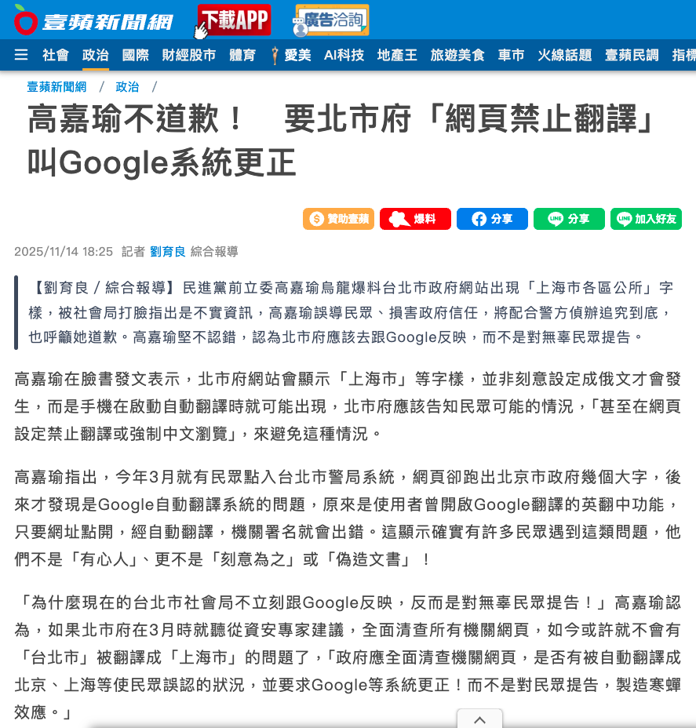
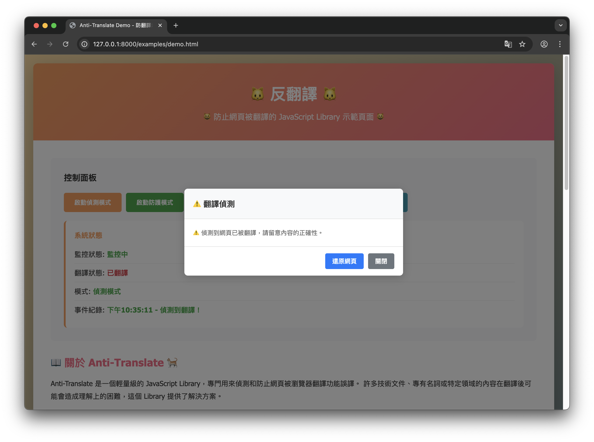

# Anti-Translate

一個輕量級的 JavaScript Library，用於偵測和防止網頁被瀏覽器翻譯功能誤譯。

## 專案緣起：一場翻譯鬧劇



> **「台北市政府」被 Google 翻譯成「上海市政府」，然後呢？**

某位立委大人說：「網站應該要禁止翻譯，叫 Google 改系統！」

啊對對對，因為 Google 翻譯不準，所以我們就不要讓使用者翻譯了。這邏輯完美到我差點以為我在看喜劇。🤡

但是，**與其在那邊吵要不要告 Google、該不該道歉**，不如我們工程師自己來解決這個問題吧！

所以這個專案就誕生了 ——

- 不想被誤譯？我幫你偵測！ 🔍
- 翻譯有問題？我幫你還原！ 🔄
- 政治口水戰？我幫你省下時間去寫 Code！ 💻

**「技術問題，用技術解決。」** 就這麼簡單。

---

## 示範畫面



## 功能特色

- 🔍 **智能偵測** - 自動偵測網頁是否被 Google Chrome、Firefox 等瀏覽器翻譯
- ⚠️ **即時警告** - 當偵測到翻譯時，立即顯示警告彈窗提醒使用者
- 🔄 **自動還原** - 可選擇自動將被翻譯的內容還原為原始語言
- ⚡ **動態支援** - 支援 Ajax、React、Vue 等動態生成的內容
- 🚀 **零依賴** - 純 Vanilla JavaScript，不依賴任何框架
- 💪 **輕量級** - 壓縮後小於 10KB

## 為什麼需要 Anti-Translate？

許多技術文件、專有名詞或特定領域的內容在經過瀏覽器自動翻譯後，常常會產生誤譯，導致理解困難甚至錯誤。Anti-Translate 提供了一個簡單的解決方案，讓開發者可以：

1. 偵測頁面何時被翻譯，並提醒使用者注意翻譯的準確性
2. 自動防止頁面被翻譯，確保內容的正確性

## 安裝

### 使用 npm

```bash
npm install anti-translate
```

### 直接引入

```html
<script src="dist/anti-translate.min.js"></script>
```

### ES6 Module

```javascript
import AntiTranslate from 'anti-translate';
```

## 快速開始

### 偵測模式

只偵測翻譯並顯示警告，不自動還原：

```javascript
AntiTranslate.init({
  mode: 'detect',
  showWarning: true,
  warningMessage: '偵測到網頁已被翻譯，請留意內容的正確性。'
});
```

### 防護模式

自動偵測並還原翻譯：

```javascript
AntiTranslate.init({
  mode: 'prevent',
  autoRevert: true
});
```

## 進階設定

### 完整設定選項

```javascript
AntiTranslate.init({
  // 模式: 'detect' 或 'prevent'
  mode: 'detect',

  // 是否顯示警告彈窗
  showWarning: true,

  // 自訂警告訊息
  warningMessage: '偵測到網頁已被翻譯，請留意內容的正確性。',

  // 是否自動還原翻譯
  autoRevert: false,

  // 檢查間隔（毫秒）
  checkInterval: 1000,

  // 是否監控動態內容
  watchDynamic: true,

  // 偵測到翻譯時的回調函數
  onDetected: (detectionResults) => {
    console.log('Translation detected:', detectionResults);
  },

  // 翻譯被還原時的回調函數
  onReverted: () => {
    console.log('Translation reverted');
  }
});
```

## API 方法

### `init(options)`

初始化 Anti-Translate 並開始監控。

```javascript
AntiTranslate.init({
  mode: 'detect',
  showWarning: true
});
```

### `startWatch()`

開始監控翻譯。

```javascript
AntiTranslate.startWatch();
```

### `stopWatch()`

停止監控翻譯。

```javascript
AntiTranslate.stopWatch();
```

### `revert()`

手動還原翻譯。

```javascript
AntiTranslate.revert();
```

### `checkTranslation()`

手動檢查當前翻譯狀態。

```javascript
const isTranslated = AntiTranslate.checkTranslation();
console.log('Is translated:', isTranslated);
```

### `isTranslated()`

取得當前翻譯狀態。

```javascript
const translated = AntiTranslate.isTranslated();
```

### `updateConfig(options)`

更新設定。

```javascript
AntiTranslate.updateConfig({
  warningMessage: '新的警告訊息'
});
```

### `destroy()`

銷毀實例並停止所有監控。

```javascript
AntiTranslate.destroy();
```

## 使用範例

### 範例 1: 基本偵測

```html
<!DOCTYPE html>
<html lang="zh-TW">
<head>
  <title>Anti-Translate Demo</title>
</head>
<body>
  <h1>防翻譯示範</h1>
  <p>這是一些測試內容</p>

  <script src="dist/anti-translate.min.js"></script>
  <script>
    AntiTranslate.init({
      mode: 'detect',
      showWarning: true
    });
  </script>
</body>
</html>
```

### 範例 2: 自訂回調

```javascript
AntiTranslate.init({
  mode: 'detect',
  onDetected: (results) => {
    // 發送分析事件
    analytics.track('page_translated', {
      methods: Object.keys(results).filter(k => results[k])
    });

    // 顯示自訂提示
    showCustomNotification('頁面已被翻譯');
  }
});
```

### 範例 3: 與 React 整合

```javascript
import { useEffect } from 'react';
import AntiTranslate from 'anti-translate';

function App() {
  useEffect(() => {
    AntiTranslate.init({
      mode: 'prevent',
      autoRevert: true
    });

    return () => {
      AntiTranslate.destroy();
    };
  }, []);

  return <div>Your App Content</div>;
}
```

## 偵測機制

Anti-Translate 使用多種方法來偵測翻譯：

1. **Font 標籤偵測** - Chrome 翻譯會包裹 `<font>` 標籤
2. **Lang 屬性變化** - 偵測 `lang` 屬性的改變
3. **Translate 屬性** - 檢查 `translate` 屬性
4. **翻譯類別** - 偵測翻譯器添加的特定 class
5. **MutationObserver** - 即時監控 DOM 變化

## 瀏覽器支援

- Chrome (推薦)
- Firefox
- Safari
- Edge
- Opera

需要支援 ES6 和 MutationObserver API。

## 開發

### 安裝依賴

```bash
npm install
```

### 建置

```bash
npm run build
```

### 開發模式

```bash
npm run dev
```

### 本地測試

```bash
npm run serve
```

然後開啟 `http://localhost:8080/examples/demo.html`

## 專案結構

```
anti-translate/
├── src/
│   ├── core/
│   │   ├── detector.js          # 偵測翻譯的核心邏輯
│   │   ├── reverter.js          # 還原翻譯的邏輯
│   │   └── content-backup.js    # 備份原始內容
│   ├── ui/
│   │   └── warning-modal.js     # 警告彈窗 UI
│   └── index.js                 # 主要入口和 API
├── dist/                        # 打包後的檔案
├── examples/                    # 使用範例
└── README.md
```

## 注意事項

1. Anti-Translate 無法 100% 防止所有翻譯，因為不同瀏覽器的翻譯機制可能不同
2. 過於頻繁的檢查可能影響效能，建議適當設置 `checkInterval`
3. 在 SPA 應用中，建議在路由變化時重新初始化
4. 還原功能可能會影響動態生成的內容，請謹慎使用

## 授權

MIT License

## 貢獻

歡迎提交 Issue 和 Pull Request！

## 更新日誌

### 1.0.0

- 初始版本發布
- 支援偵測和防護兩種模式
- 支援動態內容監控
- 提供警告彈窗 UI
